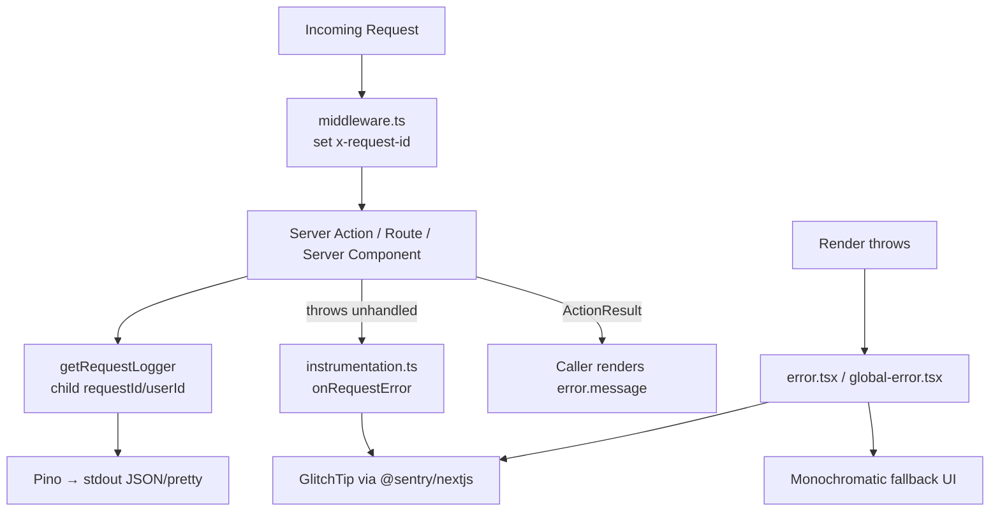

# Error Handling & Logging Design

**Spec**: `.specs/features/error-logging/spec.md`
**Status**: Draft

---

## Architecture Overview

Two orthogonal concerns, wired through Next.js 15's official extension points so we add no custom plumbing of our own:

1. **Structured logging (Pino)** — a singleton logger in `src/utils/logging/`, with a per-request child logger obtained via `getRequestLogger()` that reads the `x-request-id` header (set in middleware). Replaces every `console.*` call.
2. **Error capture (GlitchTip via `@sentry/nextjs`)** — `instrumentation.ts` registers Sentry for nodejs/edge runtimes and exports `onRequestError = Sentry.captureRequestError` so every unhandled server error (render / route / action) is captured centrally; `global-error.tsx` + per-segment `error.tsx` capture render errors and show monochromatic fallbacks. **No-op when `SENTRY_DSN` is unset** so the build runs with zero backend.

A typed `ActionResult<T>` discriminated union is introduced; the two assessment actions are migrated as the demo, their callers render `error.message` instead of blank states. Unmigrated actions keep compiling unchanged.



### Approach considered (correlation-ID propagation)

| Approach | Trade-off | Verdict |
| --- | --- | --- |
| **A. Middleware sets `x-request-id`, actions read via `headers()`** | Simple, uses only Next primitives, works for Server Actions (the action's POST request runs through middleware). One header read per logger creation. | ✅ Recommended |
| B. `AsyncLocalStorage` request context | Threads IDs through nested async calls without re-reading headers, but adds a runtime context wrapper around every entry point — more moving parts, harder to reason about in App Router. | Rejected (overkill for MVP) |

A is chosen. If a Server Action runs where the header is absent, `getRequestLogger` generates a UUID on the fly (edge case EL spec'd).

---

## Code Reuse Analysis

### Existing Components to Leverage

| Component | Location | How to Use |
| --- | --- | --- |
| Supabase server client | `src/utils/supabase/server.ts` | Keep as-is; actions already call it. Logger is added alongside, not replacing. |
| Middleware session refresh | `src/middleware.ts` → `updateSession` | Extend middleware to also set `x-request-id` before delegating; keep `updateSession` intact. |
| `Button`, `Card` components | `src/components/` | Reuse in `error.tsx` / `global-error.tsx` fallback UI (monochromatic). |
| Admin `getTextById` action | `src/app/(authenticated)/admin/texts/actions.ts` | Quiz page already calls it; leave unmigrated (out of demo scope) but it keeps working. |

### Integration Points

| System | Integration Method |
| --- | --- |
| Supabase errors | `error` objects from `supabase.from(...)` are logged via Pino's `err` serializer; action maps to `ActionError.code`. |
| GlitchTip | `@sentry/nextjs` SDK pointed at GlitchTip DSN (`SENTRY_DSN`). Sentry protocol-compatible — no custom transport. |
| Next.js build | `next.config.ts` gains `serverExternalPackages: ['pino','pino-pretty']` + `withSentryConfig`. |

---

## Components

### `logger` (Pino singleton)

- **Purpose**: Single configured Pino instance — pretty in dev, JSON→stdout in prod, with secret redaction.
- **Location**: `src/utils/logging/logger.ts`
- **Interfaces**:
  - `export const logger: Logger` — base logger.
- **Dependencies**: `pino`, `pino-pretty` (dev transport).
- **Reuses**: nothing (new infra).

### `getRequestLogger`

- **Purpose**: Return a request-scoped child logger carrying `requestId` (+ `userId` when supplied) so every log line in a request is correlatable.
- **Location**: `src/utils/logging/request-logger.ts`
- **Interfaces**:
  - `getRequestLogger(context?: { userId?: string; module?: string }): Promise<Logger>` — **async** (Next 15 `headers()` returns a Promise, must be awaited); reads `x-request-id`; generates UUID if absent. Callers do `const log = await getRequestLogger({ module })`.
- **Dependencies**: `logger`, `next/headers`.
- **Reuses**: `logger`.

### `ActionResult` + `ActionError` types

- **Purpose**: Discriminated union so callers branch on `error` vs `data` and render real messages.
- **Location**: `src/utils/actions/types.ts`
- **Interfaces**:
  - `type ActionErrorCode = 'unauthorized' | 'not_found' | 'db_error' | 'validation' | 'unknown'`
  - `interface ActionError { code: ActionErrorCode; message: string; details?: unknown }`
  - `type ActionResult<T> = { data: T; error: null } | { data: null; error: ActionError }`
  - `ok<T>(data: T): ActionResult<T>` and `fail<T>(code, message, details?): ActionResult<T>` helpers.
- **Dependencies**: none.
- **Reuses**: none.

### `instrumentation.ts`

- **Purpose**: Next.js entrypoint — register Sentry for nodejs/edge runtimes; export `onRequestError`.
- **Location**: `instrumentation.ts` (repo root)
- **Interfaces**: `register()` (runtime-gated `import` of sentry server/edge config); `onRequestError = Sentry.captureRequestError`.
- **Dependencies**: `@sentry/nextjs`.
- **Reuses**: Next.js file convention.

### `sentry.server.config.ts` / `sentry.edge.config.ts`

- **Purpose**: Initialize Sentry SDK per runtime; no-op behavior controlled by `SENTRY_DSN` presence.
- **Location**: repo root.
- **Interfaces**: `Sentry.init({ dsn: process.env.SENTRY_DSN, tracesSampleRate, enabled: !!process.env.SENTRY_DSN })`.
- **Dependencies**: `@sentry/nextjs`.
- **Reuses**: standard Sentry Next.js manual setup.

### `error.tsx` (root segment) + `global-error.tsx`

- **Purpose**: Render monochromatic fallback on render errors; report to Sentry once.
- **Location**: `src/app/error.tsx`, `src/app/global-error.tsx`.
- **Interfaces**: default export `<Error>` component receiving `{ error, reset }`.
- **Dependencies**: `@sentry/nextjs` (captureException), `Button`/`Card`.
- **Reuses**: existing component classes per `agent_docs/ui-ux_guidelines.mdc`.

### Middleware update

- **Purpose**: Attach `x-request-id` (generate if absent) to every matched request before delegating to `updateSession`.
- **Location**: `src/middleware.ts`.
- **Interfaces**: unchanged `middleware(request)`.
- **Dependencies**: `crypto.randomUUID` (Node runtime).
- **Reuses**: existing `updateSession`.

### Migrated assessment actions

- **Purpose**: Demo `ActionResult<T>` + structured logging on `getRandomDiagnosticText` and `saveDiagnosticSession`.
- **Location**: `src/app/(authenticated)/assessment/actions.ts`.
- **Interfaces**: return types become `ActionResult<Text>` / `ActionResult<AssessmentResult>`; `startAssessment` consumes the result and redirects on error.
- **Reuses**: existing Supabase calls; new `getRequestLogger`, `ok`/`fail`.

---

## Data Models

### `ActionError` / `ActionResult<T>`

```typescript
type ActionErrorCode = 'unauthorized' | 'not_found' | 'db_error' | 'validation' | 'unknown';

interface ActionError {
  code: ActionErrorCode;
  message: string;       // user-safe, pt-BR (matches existing UI strings)
  details?: unknown;     // logged, never shown to user
}

type ActionResult<T> = { data: T; error: null } | { data: null; error: ActionError };
```

**Relationships**: Returned by migrated Server Actions; unmigrated actions keep returning raw `T | null` until touched.

---

## Error Handling Strategy

| Error Scenario | Handling | User Impact |
| --- | --- | --- |
| Supabase query error in migrated action | Log via request logger (Pino `err` serializer) + `fail('db_error', msg)` | Caller renders `error.message`; logged with requestId |
| Auth missing in migrated action | `fail('unauthorized', ...)` + log | Caller redirects to login or shows message |
| Unhandled throw in Server Action/Route/Component | `onRequestError` → GlitchTip | (dev) terminal + GlitchTip; (prod) GlitchTip only |
| Render error in segment | `error.tsx` fallback + `Sentry.captureException` | Monochromatic "try again" UI |
| Root layout render error | `global-error.tsx` fallback | Full-page fallback owning `<html>/<body>` |
| `SENTRY_DSN` unset | SDK `enabled: false`; no-op | App runs normally, no capture |
| GlitchTip unreachable | Sentry swallows transport errors | Request completes; error still in Pino log |

---

## Risks & Concerns

| Concern | Location (file:line) | Impact | Mitigation |
| --- | --- | --- | --- |
| Fragile: actions swallow errors → blank state | `assessment/actions.ts:24-27,44-47,56-58,80-83` | User sees blank; dev has no context | Demo migration surfaces real messages; logger adds context. |
| `console.*` spread across ~17 files | multiple | Inconsistent, uncorrelated logs | Replace all with `getRequestLogger()` in P1. |
| No error boundaries anywhere | (absent) | Render crash = blank page | Add `error.tsx` + `global-error.tsx`. |
| Pino worker.js bundling bug in App Router | `next.config.ts` | Build/runtime crash | `serverExternalPackages: ['pino','pino-pretty']` (confirmed by research). |
| `onRequestError` async-not-awaited for Server Actions (Next PR #91523, open) | `instrumentation.ts` | Server Action errors may not finish reporting in serverless | We are self-hosted (Node server, not serverless) — request lifecycle awaits. Document as known limitation. |
| Middleware header mutation could break `updateSession` cookie logic | `src/middleware.ts` | Session refresh breaks | Set request ID before calling `updateSession`; don't touch cookie handling. |
| Mixed pt-BR/en log messages | existing `console.error` strings | Inconsistent logs | Standardize on English for log messages (machine-readable), pt-BR only for user-facing `ActionError.message`. |
| GlitchTip features absent (Replay/Profiling) | sentry config | Silent failures if enabled | Omit those integrations from config. |

---

## Tech Decisions (only non-obvious ones)

| Decision | Choice | Rationale |
| --- | --- | --- |
| Correlation ID propagation | Middleware `x-request-id` + `headers()` | Simplest Next-native; works for actions. |
| Sentry no-op gate | `enabled: !!process.env.SENTRY_DSN` + conditional `register` | Lets local dev run without GlitchTip; zero-config merge. |
| Log message language | English (logs), pt-BR (user-facing `ActionError.message`) | Logs are for devs/machines; UI strings match existing pt-BR app. |
| Logger transport | `pino-pretty` only in dev; raw JSON stdout in prod | Prod JSON is aggregatable; dev pretty is readable. |
| `ActionResult` helpers | `ok()`/`fail()` factories | Reduces boilerplate, enforces shape. |

> **Project-level decision to record:** The `ActionResult<T>` discriminated-union + `ok`/`fail` pattern becomes the project standard for all Server Actions going forward. Will be recorded as AD-001 in `.specs/STATE.md` after design approval.

---

## Open Items / Uncertainty

- **`onRequestError` serverless-await caveat (Next PR #91523):** I could not fully confirm whether this is fixed in the user's Next 15 patch level. It does not affect this self-hosted deployment (Node server awaits the request lifecycle), so I'm treating it as a documented known limitation, not a blocker. If the user later deploys to Vercel/serverless, revisit. Flagging per Knowledge Verification Chain Step 5 — uncertain, not fabricated.