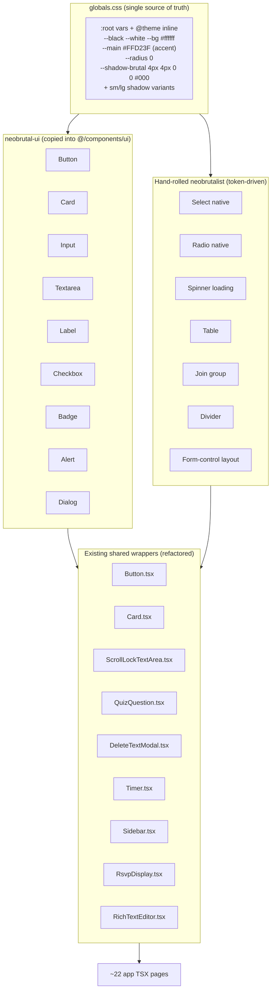

# Neobrutalism Migration Design

**Spec**: `.specs/features/neobrutalism-migration/spec.md`
**Context**: `.specs/features/neobrutalism-migration/context.md`
**Status**: Draft

---

## State Decisions Conformance

Active `AD-NNN` entries reviewed before designing (`.specs/STATE.md`):

| AD | Decision | Conformance |
| --- | --- | --- |
| AD-001 | Server Actions return `ActionResult<T>` via `ok()`/`fail()` | Conform. UI migration must preserve `ActionResult` error rendering (pt-BR) inside neobrutalist alerts. No action-shape change. |
| AD-002 | No test framework; gate = `pnpm lint && pnpm build`; final verify behavioral | Conform. Spec uses this gate; no tests invented. |
| AD-003 | Pino logging + GlitchTip/Sentry via `@sentry/nextjs` | Conform with risk. `error.tsx`/`global-error.tsx` are Sentry-coupled; restyling must not break capture/wiring. See Risks. |
| AD-004 | Logs English; `ActionError.message` pt-BR | Conform. Error UI text stays pt-BR. |

A new project-level decision is introduced: **AD-005** (this design system). Appended to
`.specs/STATE.md` below.

---

## Research Findings (neobrutal-ui compatibility — verified, not assumed)

Sources: [Bridgetamana/neobrutal-ui](https://github.com/Bridgetamana/neobrutal-ui),
[installation.mdx](https://github.com/Bridgetamana/neobrutal-ui/blob/main/content/docs/installation.mdx),
[theming.mdx](https://github.com/Bridgetamana/neobrutal-ui/blob/main/content/docs/theming.mdx).

- **Model**: shadcn-style copy-paste CLI (`npx neobrutal init` / `npx neobrutal add ...`).
  Component source is copied into `@/components/ui/*`; we own every file. Not a runtime
  npm dependency.
- **Stack**: built on **Next 16 / React 19 / Tailwind v4 / Base UI**. **Tailwind v4-only**
  (v3 dropped in v0.2.0, Jan 2026). QickReed is Next 15 / React 19 / Tailwind v4 —
  compatible (copied components are App-Router-friendly React + Base UI; Next 15 vs 16 is
  not material for copied source).
- **Theming**: `:root` CSS variables + `@theme inline` mapping in `globals.css`. Default
  tokens:
  ```css
  :root {
    --main: #B6ACE4;      /* accent */
    --bg: #f0eefc;        /* page background */
    --white: #ffffff;     /* component backgrounds */
    --black: #000000;     /* text + borders */
    --radius: 5px;
    --shadow-brutal: 4px 4px 0px 0px var(--black);
  }
  ```
- **Deps installed by `init`**: `class-variance-authority`, `clsx`, `tailwind-merge`, plus
  Base UI packages per component (`@base-ui-components/react`). Requires `@/lib/utils.ts`
  `cn()` helper (none exists today — `init` creates it; alias `@/*`→`./src/*` already in
  `tsconfig.json` ✓).
- **Components available (22)**: Accordion, Alert, Avatar, Badge, Button, Card, Checkbox,
  Dialog, Input, Label, Pagination, Popover, Progress, RadioGroup, Select, Skeleton,
  Slider, Switch, Tabs, Textarea, Toast, Tooltip.
- **Verdict**: compatible. Fallback (hand-rolled tokens) retained as contingency only,
  triggered if `init`/`add` mis-behaves on Next 15.

---

## Architecture Approach

**Chosen: Approach A — neobrutal-ui CLI + token override + hand-rolled gap fillers.**
(Approach B — full hand-rolled token system, no library — is the documented fallback if
the CLI proves incompatible. Approach C — keep DaisyUI and restyle — rejected by the
locked "full removal" decision.)



**Flow**: one token file (`globals.css`) drives both the copied neobrutal-ui components
(they read the CSS vars) and the hand-rolled primitives (which use the same vars via
`@theme inline` Tailwind tokens). Existing wrappers (`Button.tsx`, `Card.tsx`, etc.) are
refactored to delegate to the new primitives so pages change as little as possible. Pages
swap DaisyUI class names → wrapper components / token classes.

---

## DaisyUI → Target Mapping

| DaisyUI token (count) | Current shape | Target | Notes |
| --- | --- | --- | --- |
| `btn` / `btn-*` (15+7+6+2+1) | `<button class="btn ...">` + `Button.tsx` wrapper | neobrutal-ui Button (via refactored `Button.tsx`) | variants primary/secondary/outline preserved |
| `card` / `card-body` (6+6) | `Card.tsx` wrapper | neobrutal-ui Card (via refactored `Card.tsx`) | `shadow` prop → hard offset scale |
| `input` / `input-bordered` (19+8) | native `<input>` | neobrutal-ui Input | 3px border, square, hard focus |
| `select` (32) | **native `<select>`** | hand-rolled neobrutalist native `<select>` | NOT Base UI Select — avoids restructuring 32 sites |
| `textarea` | native + `ScrollLockTextArea.tsx` | neobrutal-ui Textarea | wrapper refactored |
| `label` / `label-text` (52+15) | `<label class="label">` | neobrutal-ui Label | |
| `form-control` (13) | wrapper div | hand-rolled layout (spacing) | |
| `loading` (21) | `<span class="loading loading-spinner ...">` | hand-rolled neobrutalist spinner | border-based |
| `checkbox` (3) | native `<input type=checkbox>` | neobrutal-ui Checkbox | |
| `radio` (1) | native in `QuizQuestion.tsx` | hand-rolled neobrutalist native radio | NOT RadioGroup — single usage |
| `badge` (1) | `<span class="badge">` | neobrutal-ui Badge | |
| `alert` / `alert-error` (4+4) | `<div class="alert alert-error">` | neobrutal-ui Alert | see State-without-color decision |
| `modal` (1) | `DeleteTextModal.tsx` (`modal-box`) | neobrutal-ui Dialog | wrapper refactored |
| `table` (4) | native `<table>` | hand-rolled neobrutalist table | thick borders, square |
| `join` (4) | grouping wrapper | hand-rolled join | shared borders |
| `divider` (2) | `<div class="divider">` | hand-rolled divider | |
| `range` / `tab` (1 each) | likely false-positive substrings | verify in tasks; no-op if not DaisyUI | |

`neobrutal add` set: **`button card input textarea label checkbox badge alert dialog`**.

---

## Token System (`globals.css`)

Replace the current `@plugin "daisyui"` + monochrome `@theme` block with neobrutal-ui's
`:root` + `@theme inline` scheme, overridden to QickReed's palette:

```css
@import "tailwindcss";

:root {
  --black: #000000;
  --white: #ffffff;
  --bg: #ffffff;            /* keep current pure-white page bg */
  --main: #FFD23F;          /* accent 1: primary actions / highlights / active */
  --error: #FF6B6B;         /* accent 2: error states only */
  --radius: 0;              /* square corners (override of library default 5px) */

  /* hard offset shadows, zero blur */
  --shadow-brutal: 4px 4px 0px 0px var(--black);
  --shadow-brutal-sm: 3px 3px 0px 0px var(--black);
  --shadow-brutal-lg: 6px 6px 0px 0px var(--black);
}

@theme inline {
  --color-black: var(--black);
  --color-white: var(--white);
  --color-bg: var(--bg);
  --color-main: var(--main);
  --color-error: var(--error);
  --radius-brutal: var(--radius);
  --shadow-brutal: var(--shadow-brutal);
  --shadow-brutal-sm: var(--shadow-brutal-sm);
  --shadow-brutal-lg: var(--shadow-brutal-lg);

  --font-sans: var(--font-geist-sans);
  --font-mono: var(--font-geist-mono);
}
```

- The existing monochrome `--color-primary-*` / `--color-secondary-*` / `--color-neutral-*`
  scales can stay as grays are reused for text/borders, but the `--color-success/warning`
  scales are **removed** and `--color-error` is replaced by the single `--error: #FF6B6B`
  accent (see Tech Decision: state colors).
- `@plugin "daisyui"` is removed in P1-E (after components no longer depend on it), not in
  the token task, so the app stays buildable mid-migration.

---

## Code Reuse Analysis

### Existing components to leverage

| Component | Location | How to use |
| --- | --- | --- |
| `Button.tsx` | `src/components/Button.tsx` | Refactor to delegate to `@/components/ui/button`; keep the `variant`/`size` API so pages don't change |
| `Card.tsx` | `src/components/Card.tsx` | Refactor to delegate to `@/components/ui/card`; keep `shadow`/`padding` API (shadow → hard offset scale) |
| `ScrollLockTextArea.tsx` | `src/components/ScrollLockTextArea.tsx` | Restyle the textarea via neobrutal-ui Textarea classes/tokens; keep scroll-lock behavior |
| `QuizQuestion.tsx` | `src/components/QuizQuestion.tsx` | Hand-style native radio neobrutalist; keep quiz logic |
| `DeleteTextModal.tsx` | `src/components/DeleteTextModal.tsx` | Migrate `modal-box` → neobrutal-ui Dialog; keep delete action wiring |
| `Sidebar.tsx` / `Timer.tsx` / `RsvpDisplay.tsx` / `RichTextEditor.tsx` | `src/components/` | Restyle with tokens; preserve behavior (RSVP focus/pause, timer, Quill editor) |

### Integration points

| System | Integration |
| --- | --- |
| `ActionResult<T>` error flow (AD-001) | Error `message` (pt-BR) renders inside neobrutal-ui Alert (error variant) — no shape change |
| Sentry (`@sentry/nextjs`, AD-003) | `error.tsx` / `global-error.tsx` restyled neobrutalist; **Sentry capture wiring untouched** (only JSX/classes change) |
| `@/lib/utils` `cn()` | Created by `neobrutal init`; used by copied components and our hand-rolled primitives for class merging |
| Path alias `@/*`→`./src/*` | Already in `tsconfig.json`; neobrutal-ui imports resolve cleanly |

---

## Components

### neobrutal-ui primitives (copied via CLI)
- **Purpose**: neobrutalist Button, Card, Input, Textarea, Label, Checkbox, Badge, Alert,
  Dialog — owned source under `src/components/ui/`.
- **Location**: `src/components/ui/{button,card,input,textarea,label,checkbox,badge,alert,dialog}.tsx`
- **Interfaces**: as shipped by the library (CVA variants); themed via `:root` vars.
- **Dependencies**: `@base-ui-components/react`, `class-variance-authority`, `clsx`,
  `tailwind-merge`, `@/lib/utils`.
- **Reuses**: library registry source + our token overrides.

### Hand-rolled primitives (token-driven)
- **Select** — native `<select>` styled: `border-[3px] border-black rounded-none bg-white text-black shadow-[var(--shadow-brutal-sm)] focus:outline-none focus-visible:ring-[3px] ring-black`.
- **Radio** — native `<input type=radio>` styled with thick black ring; label paired.
- **Spinner** — border-based neobrutalist spinner (e.g. `border-[3px] border-black border-r-transparent animate-spin`), square.
- **Table** — `border-[3px] border-black` cells, square, hard header.
- **Join** — adjacent bordered elements with shared borders (remove inner borders).
- **Divider** — `border-t-[3px] border-black` or labeled divider.
- **Form-control** — `flex flex-col gap-2` layout wrapper.
- **Purpose / Location / Reuses**: each lives as a shared class constant or tiny wrapper
  under `src/components/ui/` (e.g. `src/components/ui/select.tsx` exporting a styled
  native select, or a `nb` class map in `src/lib/nb-classes.ts`). Reuses the same
  `:root`/`@theme inline` tokens.

### Refactored shared wrappers
- `Button.tsx`, `Card.tsx`, `ScrollLockTextArea.tsx`, `QuizQuestion.tsx`,
  `DeleteTextModal.tsx`, `Sidebar.tsx`, `Timer.tsx`, `RsvpDisplay.tsx`,
  `RichTextEditor.tsx` — restyled to consume the primitives/tokens; APIs preserved.

---

## Data Models

N/A — no data/DB changes. Schema and `src/types/database.ts` untouched.

---

## Error Handling Strategy

| Scenario | Handling | User impact |
| --- | --- | --- |
| `ActionResult` error (pt-BR) | Renders in neobrutal-ui Alert (error variant) | Sees bold bordered alert with the pt-BR message + icon |
| Render error (Sentry) | `error.tsx`/`global-error.tsx` restyled; Sentry capture untouched | Sees neobrutalist error page; error still reported |
| `neobrutal-ui` CLI incompatibility | Fallback to hand-rolled tokens; escalate to user | Migration continues without library |

---

## Risks & Concerns

| Concern | Location | Impact | Mitigation |
| --- | --- | --- | --- |
| **State distinguishability** — success has no color (only error red); success relies on icon+text+border | `globals.css`, alerts, forms | Success states less visually loud than errors | Success uses a thick black border + check icon + pt-BR label (WCAG: not color-only). Error uses the red accent for clear chromatic signal. Confirmed acceptable in design confirmation. |
| `select` migration (32 native sites) | admin `TextForm.tsx`, `texts/page.tsx`, etc. | High touch; restructuring to Base UI Select would be risky | Hand-style native `<select>` (no Base UI Select) — class swap only. |
| Sentry coupling in error boundaries | `src/app/error.tsx`, `src/app/global-error.tsx` | Restyle could break capture if wiring touched | Change only JSX/classes; never touch `Sentry.captureException`/`nextjs` imports. Behavioral verify post-edit. |
| Base UI components are client components | copied `@/components/ui/*` | Importing into Server Components is fine, but pages that were fully server may gain client boundaries | Acceptable; Base UI primitives need `"use client"` (copied files include it). No logic moves to client. |
| Biome vs copied source formatting/import order | `src/components/ui/*`, `@/lib/utils.ts` | `pnpm lint` may flag copied files | `pnpm format` + `biome check --write` on copied files; verify alias `@/` sorts acceptably. |
| CLI mutates repo / injects CSS | `globals.css`, `components.json` | `init` may overwrite our `@theme` block or leave DaisyUI plugin | Run `init` with `--skip-css` if it conflicts, then merge tokens manually; review the diff before committing. |
| Mid-migration buildability | pages partially migrated while DaisyUI still present | A page using both can look mixed | Keep `@plugin "daisyui"` until P1-E; migrate page-by-page so each commit builds. |
| Pre-existing lint debt (83 errors) | repo-wide | Gate not achievable today | Phase-0 `biome check --write` auto-fix first; residual assessed per-error. |

---

## Tech Decisions (non-obvious)

| Decision | Choice | Rationale |
| --- | --- | --- |
| `select` (32 sites) | Hand-style native `<select>`, not neobrutal-ui Base UI Select | Avoids restructuring 32 native selects into compound components; class swap only. |
| `radio` (1 site) | Hand-style native radio, not RadioGroup | Single usage; not worth a compound migration. |
| `range` / `tab` tokens | Verify; likely no-op (false-positive substrings) | grep found no `type="range"` and only 1 `tab`. |
| State signaling (error/success) | **Error** = red `#FF6B6B` accent (fill + black text + black border + hard shadow; black-on-`#FF6B6B` ≈ 7.8:1 passes AA). **Success** = no color — icon + pt-BR label + thick black border. No green. | Honors the 2-accent palette (yellow + red); error gets a clear chromatic signal, success stays non-color and WCAG-compliant (not color-only). Confirmed by user in design confirmation. |
| Page background | `--bg: #ffffff` (keep current pure white) | Preserve current feel; TASK.md's `#FFFDF5` not adopted. |
| Icon library | Keep Heroicons (ignore library's Lucide default) | CLAUDE.md mandates Heroicons; structural components don't force Lucide. |
| Library CSS injection | Prefer `init --skip-css` + manual token merge | Protects our `@theme`/DaisyUI staging; full control of `globals.css`. |
| Where neobrutal-ui components live | `src/components/ui/*` (library default) | Matches `@/*` alias; coexists with existing `src/components/*` wrappers. |

> **Project-level decision AD-005** (appended to `.specs/STATE.md`): the QickReed design
> system is neobrutalism — neobrutal-ui components + `globals.css` token system, palette
> monochrome + one accent `#FFD23F`, bold-everywhere. Supersedes the prior CLAUDE.md /
> `ui-ux_guidelines.mdc` DaisyUI + strict-monochrome mandates (which P1-F rewrites).

---

## Design Confirmation (resolved)

The state-color question was confirmed: **2-accent palette** — `#FFD23F` (yellow,
primary/highlights/active) + `#FF6B6B` (red, error states); success stays non-color
(icon + pt-BR text + border). Spec, context, and AD-005 updated accordingly. Design
approved; proceeding to tasks.